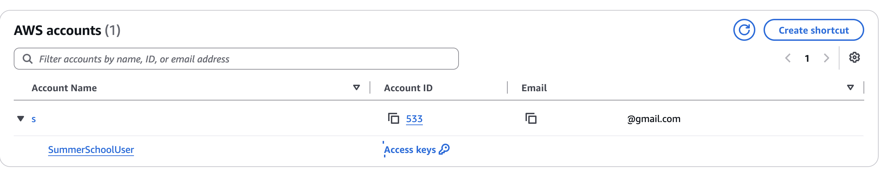
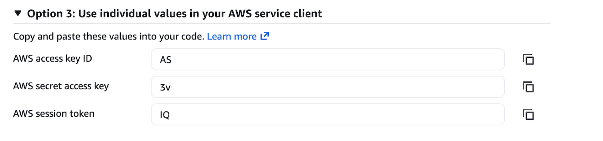
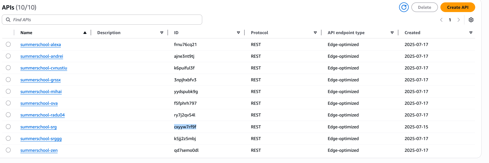
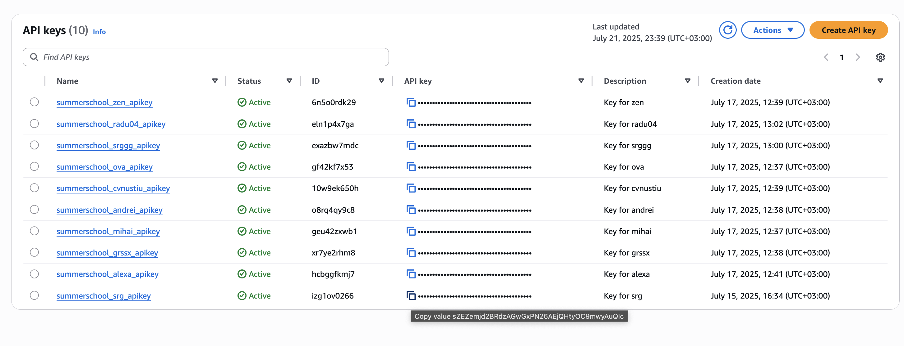
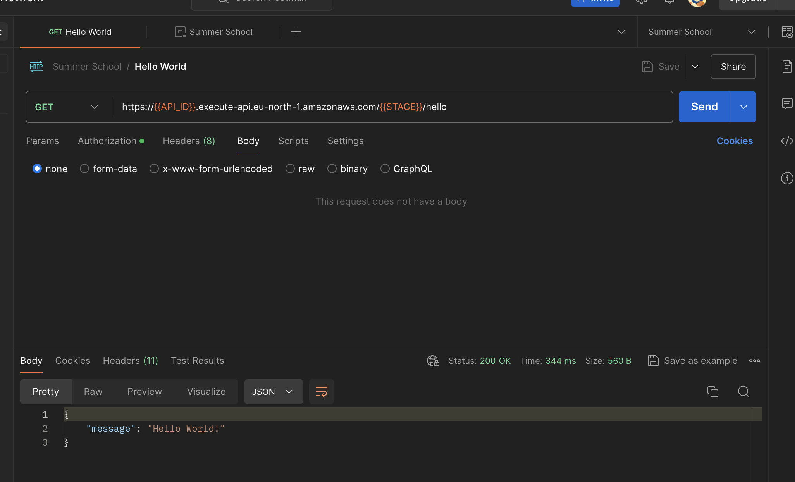

# Cloud Computing Lab - Student Setup Guide

## Prerequisites

- A **GitHub account** - sign up at https://github.com/signup
- Your **AWS access keys** (Access Key ID + Secret Access Key) - provided by your instructor
- **Postman** installed - download at https://www.postman.com/downloads/
- The **course repository** link: https://github.com/sergiuvoicu/CloudComputingSummerSchool
- A **unique stage name** within the class - recommended: first 3 letters of your first
  name + first 3 letters of your last name (e.g. Sergiu Voicu → `servoi`)
- Access the mail sent to you with the invitation to register to the AWS Account
- Configure your profile

---

## Step 1 - Add your AWS keys as Codespaces secrets

Do this **before** Step 2. Names must match exactly (uppercase).
1. Access `https://ssoins-65082f5cc24fe672.portal.eu-north-1.app.aws` and login with the configured profile
2. Copy the Access Key ID, Secret Access Key and Session Token by opening "Access keys"
    
    

3. Go to https://github.com/settings/codespaces
4. **Codespaces secrets** → **New secret**
   - Name: `AWS_ACCESS_KEY_ID`
   - Value: your Access Key ID provided
   - Repository access: search for and select **`sergiuvoicu/CloudComputingSummerSchool`**
   - **Add secret**
5. **New secret** again
   - Name: `AWS_SECRET_ACCESS_KEY`
   - Value: your Secret Access Key provided
   - Repository access: search for and select **`sergiuvoicu/CloudComputingSummerSchool`**
   - **Add secret**
6. **New secret** again
   - Name: `AWS_SESSION_TOKEN`
   - Value: your Secret Access Key provided
   - Repository access: search for and select **`sergiuvoicu/CloudComputingSummerSchool`**
   - **Add secret**
---

## Step 2 - Create your codespace

1. Open https://github.com/sergiuvoicu/CloudComputingSummerSchool
2. **Code** → **Codespaces** tab → **Create codespace on main**

---

## Step 3 - Wait for setup (~5 minutes), then deploy

1. Wait until the terminal shows:
   - `✅ AWS credentials OK - account <number>, region eu-north-1`
   - `✅ Environment ready.`
2. If you don't see the banner, run:
   ```bash
   bash .devcontainer/post-create.sh
   ```
3. Deploy (replace `<your-stage>` with your stage name):
   ```bash
   ./node_modules/.bin/serverless deploy --stage <your-stage> --region eu-north-1 --config serverless.yml
   ```
4. Wait for the `endpoints:` section with your API URL.

---

## Closing your codespace

**Stop** (between sessions - keeps your files, frees compute):

- Bottom-left corner → click the codespace name → **Stop Current Codespace**
- Or go to https://github.com/codespaces, find your codespace, click the **`...`**
  (three-dot menu) on its right, then click **Stop codespace**

**Delete** (when finished - push your work to Git first):

- Go to https://github.com/codespaces, click the **`...`** (three-dot menu) next to your
  codespace, then click **Delete**

Stop between sessions. Delete only after you've pushed any work you want to keep.

---

## Step 4 Postman Setup

- On GitHub, open the repo's postman/ folder: https://github.com/sergiuvoicu/CloudComputingSummerSchool/tree/main/postman
- Click the collection file → on the file page click the Download raw file button (the download icon, top-right of the file view). Repeat for the environment file.
- In desktop Postman → Import (top-left) → drag in (or browse to) the two downloaded files → Import.
- Top-right environment dropdown → select the imported environment.
- Update the environment values as such:
    - Populate STAGE with the name you chose for your stack
    - To populate the API_ID, login to your AWS user, go to Search -> API Gateway -> Look for summerschool-<your-stack-name> -> take the corresponding ID
    
    - To populate the API_KEY, login to your AWS user, go to Search -> API Gateway -> API Keys (left side) -> Look for summerschool-<your-stack-name> -> take the corresponding ID
    
- Make sure you save the environment and you have it selected (top right). You can now send a request
    

## Troubleshooting

| Symptom | Fix |
|---|---|
| No `✅ Environment ready` banner | Run `bash .devcontainer/post-create.sh` |
| ⚠️ AWS credentials warning | Re-check both secrets + repo access (Step 1), then press `Ctrl`/`Cmd`+`Shift`+`P`, type **Rebuild Container** in the search box, and click it |
| `python3.13` runtime warning on deploy | Ignore it |
| `{"message":"Forbidden"}` when testing | Add the `x-api-key` header with your API key (see note below) |
| Deploy permission errors | Contact your instructor |

**Finding your API key:** after deploying, the terminal prints an `api keys:` section like:

```
api keys:
  summerschool_servoi_apikey: <your-secret-key> - Key for servoi
```

When testing your endpoint in postman, add a header named `x-api-key` set to that `<your-secret-key>`
value.

# Local Serverless Setup
## Prerequisites
### MacOS
1. Install git https://git-scm.com/
2. Check installation by git --version in a terminal
3. Install Node https://nodejs.org/en
4. Check installation by node --version and npm --version
5. Install aws CLI https://docs.aws.amazon.com/cli/latest/userguide/getting-started-install.html
6. Check installation by aws --version
7. Install direnv https://direnv.net/docs/installation.html
8. Check installation by direnv --version
9. Install pyenv https://github.com/pyenv/pyenv
9. Install Postman

### Linux / Windows - Use WSL
1. Install git on your local machine - https://git-scm.com/downloads
2. Open a terminal and check installation by `git --version`.
3. `git clone https://github.com/sergiuvoicu/CloudComputingSummerSchool`
4. Install WSL https://learn.microsoft.com/en-us/windows/wsl/install
    1. `wsl --install`
    2. `wsl --install -d Ubuntu-20.04`
    3. Install the WSL extension for VSCode - Optional
    4. Open a terminal and check installation by `wslconfig /l`
5. Go to VSCode and open a WSL terminal. If it does not work due to trying to open it using bash, go to C/Users/<user>/     AppData/Roaming/Code/User/settings.json and there paste:
```
    "terminal.integrated.profiles.windows": {
        "Ubuntu-20.04": {
            "path": "C:\\Windows\\System32\\wsl.exe",
            "args": ["-d", "Ubuntu-20.04"]
        }
    }
```
6. Open the newly configured terminal
7. Install Node through NVM https://learn.microsoft.com/en-us/windows/dev-environment/javascript/nodejs-on-wsl
    1. `sudo apt-get install curl`
    2. `curl -o- https://raw.githubusercontent.com/nvm-sh/nvm/master/install.sh | bash`
    3. `nvm install --lts`
    4. Reopen the terminal and check installation by `node --version` and `npm --version`
8. Install AWS CLI https://docs.aws.amazon.com/cli/latest/userguide/getting-started-install.html
    1. `sudo apt install unzip`
    2. `curl "https://awscli.amazonaws.com/awscli-exe-linux-x86_64.zip" -o "awscliv2.zip"`
    3. `unzip awscliv2.zip`
    4. `sudo ./aws/install`
    5. Reopen the terminal and check installation by `aws --version`
    6. Remove awscliv2.zip and aws directory
9. Install direnv https://direnv.net/docs/installation.html
    1. `curl -sfL https://direnv.net/install.sh | bash`
    2. `echo 'eval "$(direnv hook bash)"' >> ~/.bashrc`
    3. Reopen the terminal and check installation by `direnv --version`
10. Install pyenv https://github.com/pyenv/pyenv
    1. `curl -fsSL https://pyenv.run | bash`
    2. `echo 'export PYENV_ROOT="$HOME/.pyenv"' >> ~/.bashrc`
    3. `echo '[[ -d $PYENV_ROOT/bin ]] && export PATH="$PYENV_ROOT/bin:$PATH"' >> ~/.bashrc`
    4. `echo 'eval "$(pyenv init - bash)"' >> ~/.bashrc`
    5. `sudo apt-get update`
    6. `sudo apt-get upgrade`
    7. `sudo apt install build-essential curl libbz2-dev libffi-dev liblzma-dev libncursesw5-dev libreadline-dev libsqlite3-dev libssl-dev libxml2-dev libxmlsec1-dev llvm make tk-dev wget xz-utils zlib1g-dev`
    8. `pyenv install 3.13.5`
    9. `pyenv global 3.13.5`
11. Reopen the terminal and check installation by `python --version`
12. Install uv https://docs.astral.sh/uv/guides/install-python/
    1. curl -LsSf https://astral.sh/uv/install.sh | sh

## Setup
1. npm ci
2. `aws configure`
    1. Fill in with the provided Access Key
    2. Fill in with the provided Secret Access Key
    3. Fill in with `eu-north-1`
    4. FIll in with `json`
3. Check installation by `./node_modules/.bin/serverless --version`
4. Optional: npm install -g serverless@3.40.0
5. Rename .envrc2 to .envrc
    1. Set PROJ_NAME=<your-stack-name>
    2. Set AWS_DEFAULT_REGION=eu-north-1
    3. Set AWS_REGION=eu-north-1
    4. Set environment=summerschool_<your-stack-name>_
    5. Set aws_account_id=<your_account_id>
5. `sudo apt-get install dos2unix`
6. `dos2unix .envrc`
5. Run direnv allow in the terminal

Expected outcome:
```
direnv allow
direnv: loading ~/Documents/SummerSchoolCloudComputing/.envrc
direnv: export +AWS_DEFAULT_REGION +AWS_REGION +PROJ_STAGE +VIRTUAL_ENV +aws_account_id +environment ~PATH ~XPC_SERVICE_NAME
```
6. uv venv dependencies/python --no-managed-python
7. source dependencies/python/bin/activate
8. uv sync --active --locked --no-managed-python
9. deactivate
10. uv venv --no-managed-python
11. source .venv/bin/activate
12. uv sync --active --locked --no-managed-python


## Usage

- To deploy: `./node_modules/.bin/serverless deploy --stage <unique_stack_name> --region eu-north-1 --v --config serverless.yml`. Example: ./node_modules/.bin/serverless deploy --stage srg --region eu-north-1 --v --config serverless.yml