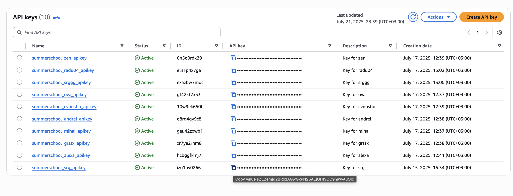

# Prerequisites
## MacOS
1. Install git https://git-scm.com/
2. Check installation by git --version in a terminal
3. Install Node https://nodejs.org/en
4. Check installation by node --version and npm --version
5. Install aws CLI https://docs.aws.amazon.com/cli/latest/userguide/getting-started-install.html
6. Check installation by aws --version
7. Install direnv https://direnv.net/docs/installation.html
8. Check installation by direnv --version
9. Install pyenv https://github.com/pyenv/pyenv
9. Install Postman

## Linux / Windows - Use WSL
1. Install git on your local machine - https://git-scm.com/downloads
2. Open a terminal and check installation by `git --version`.
3. `git clone https://github.com/sergiuvoicu/CloudComputingSummerSchool`
4. Install WSL https://learn.microsoft.com/en-us/windows/wsl/install
    1. `wsl --install`
    2. `wsl --install -d Ubuntu-20.04`
    3. Install the WSL extension for VSCode - Optional
    4. Open a terminal and check installation by `wslconfig /l`
5. Go to VSCode and open a WSL terminal. If it does not work due to trying to open it using bash, go to Users/<user>/Roaming/AppData/Code/settings.json and paste there
6. Open the newly configured terminal
7. Install Node through NVM https://learn.microsoft.com/en-us/windows/dev-environment/javascript/nodejs-on-wsl
    1. `sudo apt-get install curl`
    2. `curl -o- https://raw.githubusercontent.com/nvm-sh/nvm/master/install.sh | bash`
    3. `nvm install --lts`
    4. Reopen the terminal and check installation by `node --version` and `npm --version`
8. Install AWS CLI https://docs.aws.amazon.com/cli/latest/userguide/getting-started-install.html
    1. `sudo apt install unzip`
    2. `curl "https://awscli.amazonaws.com/awscli-exe-linux-x86_64.zip" -o "awscliv2.zip"`
    3. `unzip awscliv2.zip`
    4. `sudo ./aws/install`
    5. Reopen the terminal and check installation by `aws --version`
    6. Remove awscliv2.zip and aws directory
9. Install direnv https://direnv.net/docs/installation.html
    1. `curl -sfL https://direnv.net/install.sh | bash`
    2. `echo 'eval "$(direnv hook bash)"' >> ~/.bashrc`
    3. Reopen the terminal and check installation by `direnv --version`
10. Install pyenv https://github.com/pyenv/pyenv
    1. `curl -fsSL https://pyenv.run | bash`
    2. `echo 'export PYENV_ROOT="$HOME/.pyenv"' >> ~/.bashrc`
    3. `echo '[[ -d $PYENV_ROOT/bin ]] && export PATH="$PYENV_ROOT/bin:$PATH"' >> ~/.bashrc`
    4. `echo 'eval "$(pyenv init - bash)"' >> ~/.bashrc`
    5. `sudo apt-get update`
    6. `sudo apt-get upgrade`
    7. `sudo apt-get install build-essential`
    8. `pyenv install 3.11.2`
    9. `pyenv global 3.11.2`
11. Reopen the terminal and check installation by `python --version`

# Setup
1. npm install
2. `aws configure`
    1. Fill in with the provided Access Key
    2. Fill in with the provided Secret Access Key
    3. Fill in with `eu-north-1`
    4. FIll in with `json`
3. Check installation by `./node_modules/.bin/serverless --version`
4. Optional: npm install -g serverless@3.40,0
5. Rename .envrc2 to .envrc
    1. Set PROJ_NAME=<your-stack-name>
    2. Set AWS_DEFAULT_REGION=eu-north-1
    3. Set AWS_REGION=eu-north-1
    4. Set environment=summerschool_<your-stack-name>_
    5. Set aws_account_id=<your_account_id>
5. Run direnv allow in the terminal

Expected outcome:
```
direnv allow
direnv: loading ~/Documents/SummerSchoolCloudComputing/.envrc
direnv: export +AWS_DEFAULT_REGION +AWS_REGION +PROJ_STAGE +VIRTUAL_ENV +aws_account_id +environment ~PATH ~XPC_SERVICE_NAME
```
6. pip install -r dependencies/requirements.txt -t dependencies/python/lib/python3.11/site-packages
7. pip install -r requirements-dev.txt


# Usage

- To deploy: `./node_modules/.bin/serverless deploy --stage <unique_stack_name> --region eu-north-1 --v --config serverless.yml`. Example: ./node_modules/.bin/serverless deploy --stage srg --region eu-north-1 --v --config serverless.yml
- Open postman, click Import and choose the files in the postman directory of this repository
- Update the environment values as such:
    - Populate STAGE with the name you chose for your stack
    - To populate the API_ID, login to your AWS user, go to Search -> API Gateway -> Look for summerschool-<your-stack-name> -> take the corresponding ID
    
    - To populate the API_ID, login to your AWS user, go to Search -> API Gateway -> API Keys (left side) -> Look for summerschool-<your-stack-name> -> take the corresponding ID
    
- Make sure you save the environment and you have it selected (top right). You can now send a request
    
